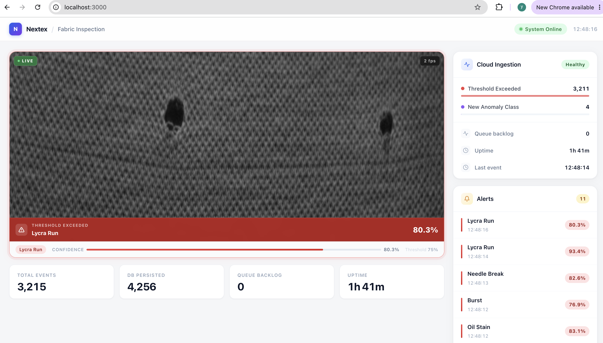
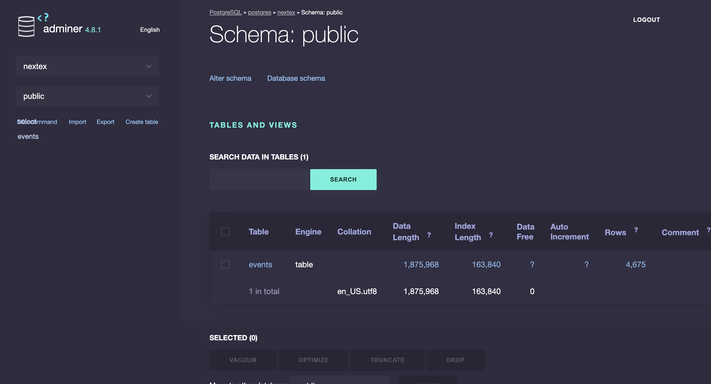
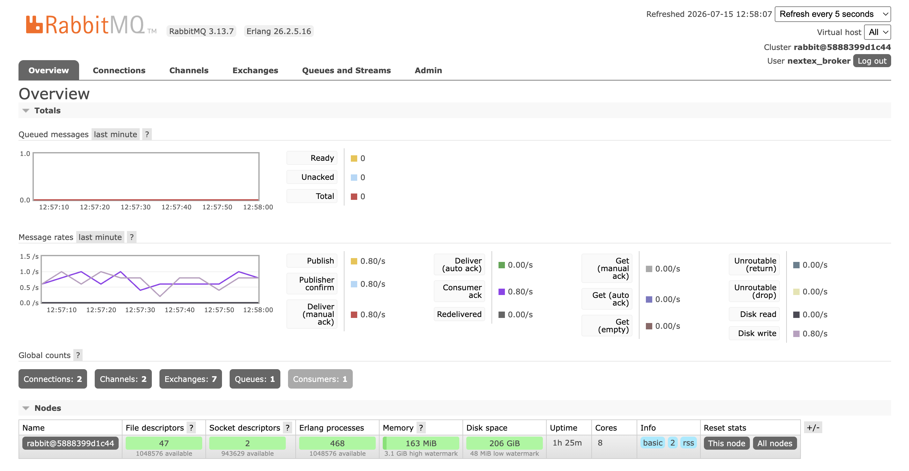
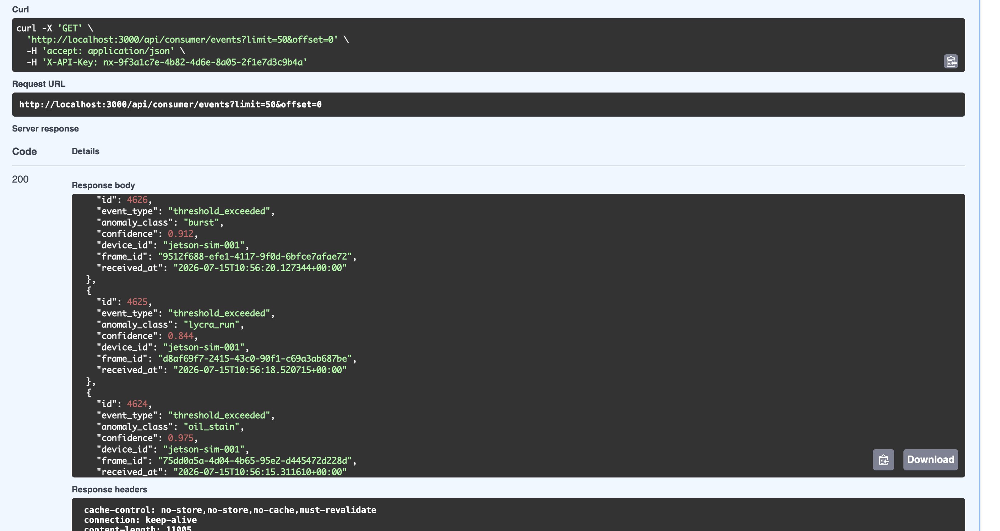
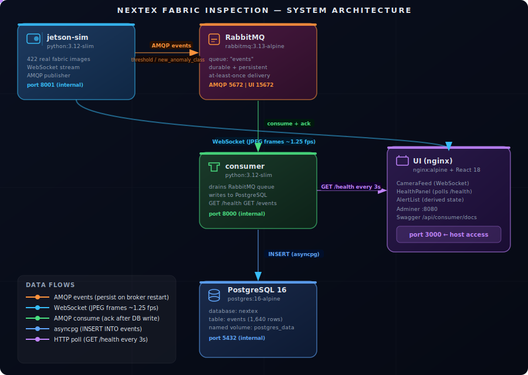
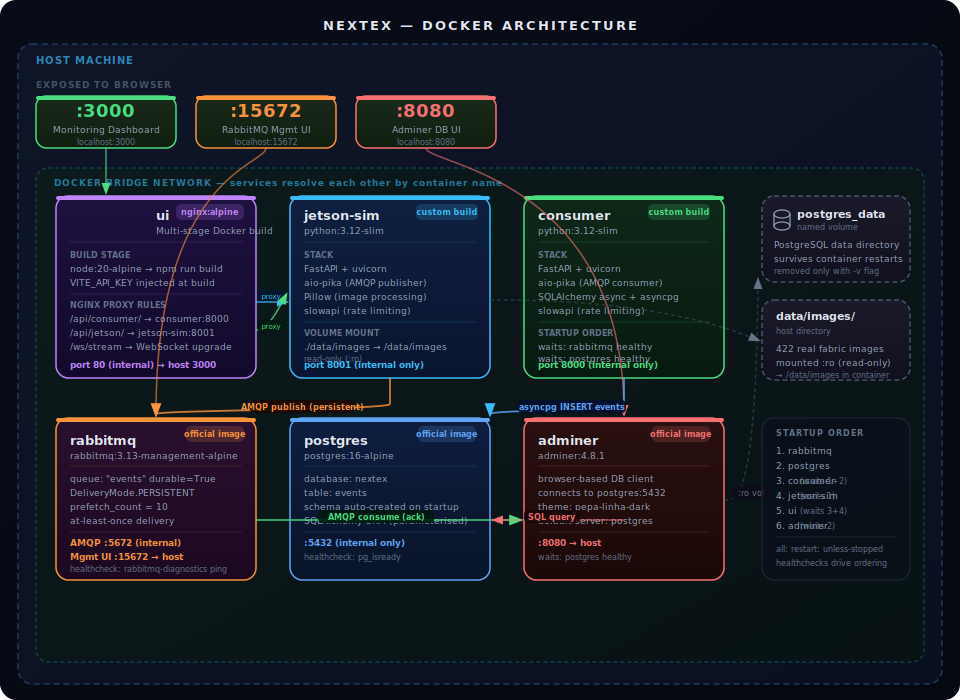

# Nextex Fabric Inspection Platform

Real-time simulation of an industrial fabric defect detection pipeline. A Jetson device streams live camera frames, an anomaly detection model classifies each frame, critical events flow through a message broker to a cloud ingestion service, and a monitoring dashboard surfaces everything in real time.

---

## Screenshots

| Monitoring Dashboard                | PostgreSQL via Adminer            |
| ----------------------------------- | --------------------------------- |
|  |  |

| RabbitMQ Management               | Swagger API                         |
| --------------------------------- | ----------------------------------- |
|  |  |

---

## Table of Contents

1. [How It Works](#how-it-works)
2. [System Architecture](#system-architecture)
3. [Docker Architecture](#docker-architecture)
4. [Quick Start](#quick-start)
5. [Accessing the System](#accessing-the-system)
6. [Dataset](#dataset)
7. [Event Types](#event-types)
8. [API Reference](#api-reference)
9. [Configuration](#configuration)
10. [Security](#security)
11. [Project Structure](#project-structure)

---

## How It Works

```
Real fabric images on disk
        │
        ▼
 jetson-sim reads next image → resizes to 640×480 → assigns confidence score
        │
        ├──► WebSocket broadcast ──► Browser displays live feed
        │
        └──► If threshold exceeded or new class detected:
                    │
                    ▼
             Publish event to RabbitMQ (durable, persistent)
                    │
                    ▼
             consumer drains queue → writes to PostgreSQL
                    │
                    ▼
             GET /health reflects updated counts
                    │
                    ▼
             Dashboard KPI tiles and HealthPanel update every 3 seconds
```

Two categories of event flow to the cloud:

| Event                  | Trigger                                                    |
| ---------------------- | ---------------------------------------------------------- |
| `new_anomaly_class`  | A defect type that has never been seen before this session |
| `threshold_exceeded` | Any frame whose detection confidence is above 75%          |

---

## System Architecture



---

## Docker Architecture

> Each container is shown with its base image, stack, ports, volumes, and startup dependencies.



---

## Quick Start

### Prerequisites

Docker Desktop installed and running. That is the only requirement.

### Steps

**1. Copy the environment file**

```bash
cp .env.example .env
```

**2. Set your API key**

Open `.env` and replace the `API_KEY` value. Generate a secure one:

```bash
python3 -c "import secrets; print('nx-' + secrets.token_hex(16))"
```

> Do not use `@`, `#`, or `%` in any password. These characters break URL parsing in `DATABASE_URL` and `RABBITMQ_URL`.

**3. Start the full stack**

```bash
docker compose up --build
```

First run downloads base images and installs dependencies — allow 3 to 5 minutes. Subsequent runs start in under 30 seconds.

**4. Open the dashboard**

```
http://localhost:3000
```

---

## Accessing the System

### Monitoring Dashboard

```
http://localhost:3000
```

### Consumer API: Swagger UI

```
http://localhost:3000/api/consumer/docs
```

1. Click **Authorize** (lock icon, top right)
2. Enter your `API_KEY` value from `.env`
3. Click **Authorize** then **Close**
4. Expand any endpoint and click **Try it out**

### Jetson Simulator API

```
http://localhost:3000/api/jetson/docs
```

Same authorization flow as the consumer.

### RabbitMQ Management UI

```
http://localhost:15672
```

Login credentials are in your `.env`:

| Field    | Value                     |
| -------- | ------------------------- |
| Username | `RABBITMQ_DEFAULT_USER` |
| Password | `RABBITMQ_DEFAULT_PASS` |

What to look for: the **Queues** tab shows the `events` queue depth, publish rate, and consumer count in real time.

Alternatively from the terminal, without opening a browser:

```bash
docker exec rabbitmq rabbitmqctl list_queues name messages consumers
```

### Adminer: Database UI

```
http://localhost:8080
```

Fill in the login form:

| Field    | Value                               |
| -------- | ----------------------------------- |
| System   | PostgreSQL                          |
| Server   | `postgres`                        |
| Username | `POSTGRES_USER` from `.env`     |
| Password | `POSTGRES_PASSWORD` from `.env` |
| Database | `nextex`                          |

Browse the `events` table, run SQL queries, export to CSV.

### PostgreSQL: Direct Terminal Access

```bash
# Interactive SQL shell
docker exec -it postgres psql -U nextex -d nextex

# queries
docker exec postgres psql -U nextex -d nextex \
  -c "SELECT event_type, count(*), round(avg(confidence)::numeric,3) AS avg_conf
      FROM events GROUP BY event_type;"
```

---

## Dataset

422 real fabric defect photographs sourced from [aaozgur/fabric-defect-dataset-v4](https://huggingface.co/datasets/aaozgur/fabric-defect-dataset-v4) on HuggingFace. Public.

| Class            | Folder                        | Images | Defect description                   |
| ---------------- | ----------------------------- | ------ | ------------------------------------ |
| `burst`        | `data/images/burst/`        | 105    | Broken loops, burst fabric structure |
| `lycra_run`    | `data/images/lycra_run/`    | 107    | Lycra thread ladder defect           |
| `needle_break` | `data/images/needle_break/` | 105    | Needle breakage marks                |
| `oil_stain`    | `data/images/oil_stain/`    | 105    | Oil contamination                    |

Original resolution: 1300 × 400 px. Resized to 640 × 480 at stream time. Shuffled on startup, cycled sequentially. The subfolder name becomes the `anomaly_class` value that flows into every event and every database row.

To re-download from scratch:

```bash
pip install pandas pyarrow Pillow
cd data && python download_dataset.py
```

---

## Event Types

| `event_type`         | Trigger                                  | What it means                               |
| ---------------------- | ---------------------------------------- | ------------------------------------------- |
| `threshold_exceeded` | `confidence > 0.75`                    | Operator alert: defect is highly confident |
| `new_anomaly_class`  | First occurrence of a class this session | Model retraining signal                     |

---

## API Reference

All HTTP endpoints require the header `X-API-Key: <your key>`.

### GET /health

Returns ingestion metrics. Rate limit: 30 req/min.

```json
{
  "status": "ok",
  "uptime_seconds": 801.2,
  "processed_total": 599,
  "queue_backlog": 0,
  "events_by_type": {
    "threshold_exceeded": 595,
    "new_anomaly_class": 4
  },
  "last_event_at": "2024-10-01T10:34:22.000Z",
  "db_event_count": 1640
}
```

### GET /events

Returns stored events from PostgreSQL, newest first. Rate limit: 20 req/min.

Parameters: `limit` (1–200, default 50) and `offset` (0–100000, default 0).

```json
[
  {
    "id": 1640,
    "event_type": "threshold_exceeded",
    "anomaly_class": "burst",
    "confidence": 0.871,
    "device_id": "jetson-sim-001",
    "frame_id": "3f4a2b1c-...",
    "received_at": "2024-10-01T10:34:22+00:00"
  }
]
```

### GET /stats

Returns simulator runtime state. Rate limit: 30 req/min.

```json
{
  "frames_generated": 998,
  "events_sent": 599,
  "connected_clients": 1,
  "seen_anomaly_classes": ["burst", "lycra_run", "needle_break", "oil_stain"],
  "threshold": 0.75,
  "dataset_classes": ["burst", "lycra_run", "needle_break", "oil_stain"],
  "dataset_image_count": 422
}
```

### WS /ws/stream

WebSocket, no API key required. Each message is a JSON string:

```json
{
  "type": "frame",
  "data": "<base64 JPEG>",
  "meta": {
    "frame_id": "uuid-v4",
    "frame_index": 1042,
    "device_id": "jetson-sim-001",
    "anomaly_class": "burst",
    "confidence": 0.871,
    "has_anomaly": true,
    "threshold": 0.75,
    "threshold_exceeded": true,
    "timestamp": 1720000000.123,
    "source": "image_filename.jpg"
  }
}
```

---

## Configuration

All values live in `.env`. Copy `.env.example` to get started.

> Passwords must not contain `@`, `#`, or `%` these characters break URL parsing.

| Variable                  | Used by                  | Purpose                                                       |
| ------------------------- | ------------------------ | ------------------------------------------------------------- |
| `API_KEY`               | consumer, jetson-sim, ui | Shared secret for all HTTP endpoints                          |
| `ALLOWED_ORIGIN`        | consumer, jetson-sim     | Only CORS origin permitted (default`http://localhost:3000`) |
| `DATABASE_URL`          | consumer                 | PostgreSQL async connection string                            |
| `RABBITMQ_URL`          | consumer, jetson-sim     | AMQP connection string                                        |
| `POSTGRES_PASSWORD`     | postgres                 | Database password                                             |
| `RABBITMQ_DEFAULT_PASS` | rabbitmq                 | Broker password                                               |
| `FRAME_INTERVAL_MS`     | jetson-sim               | Milliseconds between frames (default`800`)                  |
| `ANOMALY_THRESHOLD`     | jetson-sim               | Confidence threshold for alerts (default`0.75`)             |
| `DATASET_PATH`          | jetson-sim               | Path to images inside the container                           |

---

## Security

| Control                      | How it is implemented                                                          |
| ---------------------------- | ------------------------------------------------------------------------------ |
| Secrets never in source code | All credentials in`.env`, excluded by `.gitignore`                         |
| API key on every endpoint    | `X-API-Key` header required.                                                 |
| Key compiled into UI bundle  | `VITE_API_KEY` Docker build arg, no runtime secret exposure                 |
| CORS locked to one origin    | `allow_origins=["*"]` replaced with the exact UI origin                      |
| Rate limiting at two layers  | SlowAPI inside Python services + nginx rate zones                              |
| Input bounds on query params | `limit` max 200, `offset` max 100,000                                      |
| Security response headers    | X-Frame-Options, X-Content-Type-Options, CSP, Referrer-Policy on all responses |
| Server version hidden        | `server_tokens off` in nginx, `Server` header deleted in Python            |
| GET-only enforcement         | nginx`limit_except GET { deny all; }` at proxy layer                         |
| Port isolation               | Only port 3000 exposed; DB and broker are Docker-internal                      |
| Dataset read-only            | `./data/images:/data/images:ro`                                              |
| SQL injection impossible     | SQLAlchemy ORM with parameterised queries throughout                           |
| Attack paths blocked         | nginx returns 404 for`.env`, `.git`, `.php`, `wp-admin`                |

---

## Project Structure

```
nextex/
├── .env.example             ← copy to .env and fill in secrets
├── docker-compose.yml       ← orchestrates all 6 services
│
├── consumer/                ← cloud-side event ingestion service
│   ├── Dockerfile           ← python:3.12-slim, uvicorn with --root-path
│   ├── requirements.txt     ← fastapi, aio-pika, sqlalchemy, asyncpg, slowapi
│   ├── main.py              ← API key auth, rate limiter, RabbitMQ consumer,
│   │                           PostgreSQL ORM, /health, /events endpoints
│   └── settings.py          ← reads env vars via pydantic-settings
│
├── jetson-sim/              ← simulated Jetson Orin device
│   ├── Dockerfile           ← python:3.12-slim
│   ├── requirements.txt     ← fastapi, aio-pika, Pillow, slowapi
│   ├── main.py              ← DatasetLoader, WebSocket stream loop,
│   │                           AMQP publisher, /stats endpoint
│   └── settings.py          ← reads env vars via pydantic-settings
│
├── data/
│   ├── download_dataset.py  ← re-downloads from HuggingFace if needed
│   └── images/              ← 422 real fabric defect images (committed)
│       ├── burst/           (105 images)
│       ├── lycra_run/       (107 images)
│       ├── needle_break/    (105 images)
│       └── oil_stain/       (105 images)
│
├── ui/                      ← React monitoring dashboard
│   ├── Dockerfile           ← multi-stage: node:20 build → nginx:alpine serve
│   ├── nginx.conf           ← reverse proxy, rate limiting, security headers
│   ├── package.json         ← react 18, typescript, vite
│   └── src/
│       ├── App.tsx           ← root layout, KPI tiles, clock, status pill
│       ├── types.ts          ← FrameMeta, HealthData TypeScript interfaces
│       ├── components/
│       │   ├── CameraFeed.tsx       ← live feed, lightbox modal, alert overlay
│       │   ├── HealthPanel.tsx      ← ingestion metrics, event type bars
│       │   └── AlertList.tsx        ← threshold alert history, slide-in animation
│       ├── hooks/
│       │   ├── useJetsonStream.ts   ← WebSocket connection, FPS counter, reconnect
│       │   ├── useHealthPoll.ts     ← polls /health every 3s with API key
│       │   └── useAlertHistory.ts   ← derives alerts from frame stream (no API call)
│       └── styles/
│           └── global.css   ← CSS custom properties design system
│
├── README.md
├── GUIDE.md                 ← complete reference for every file and data flow
└── design-notes.md          ← architectural decisions and production considerations
```
